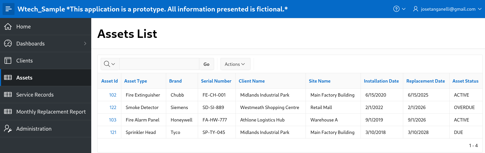
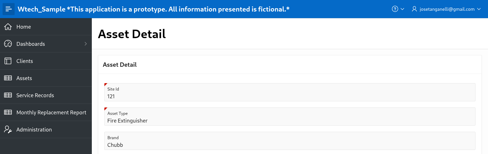
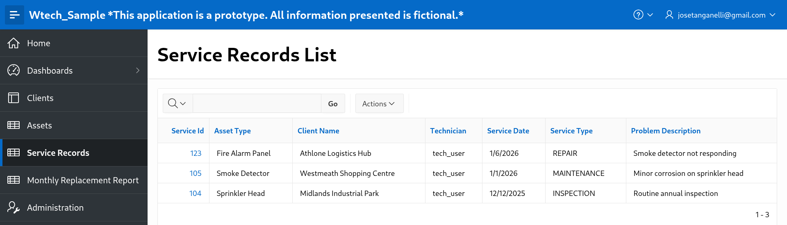
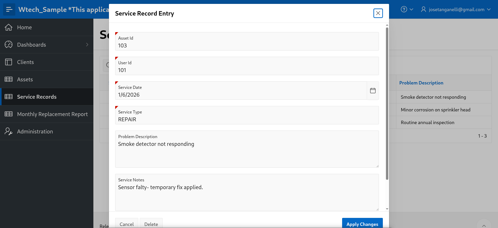
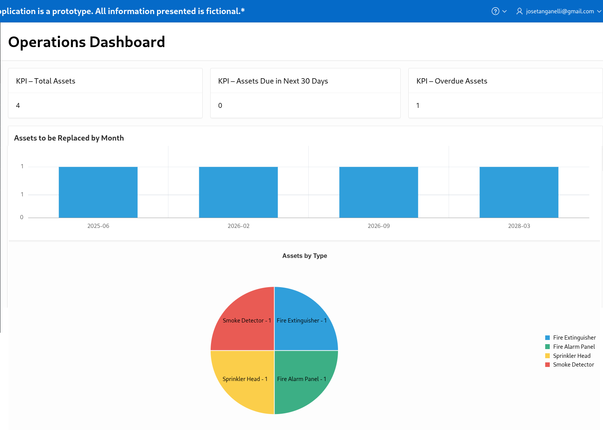
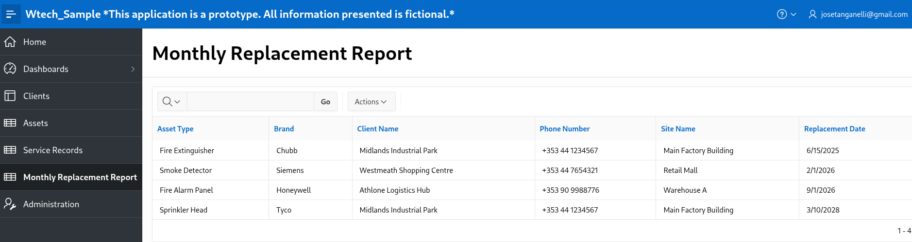
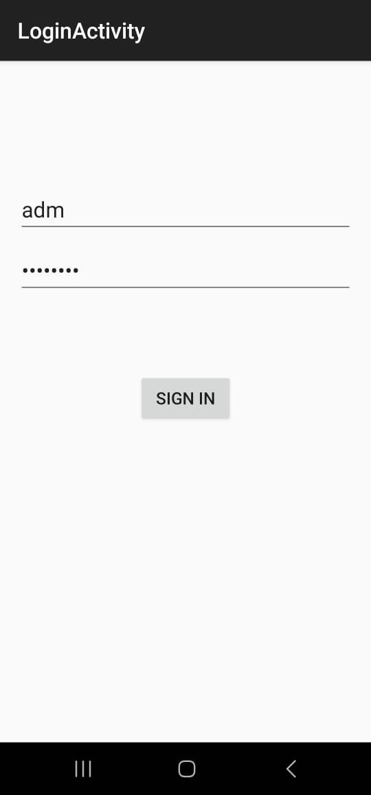
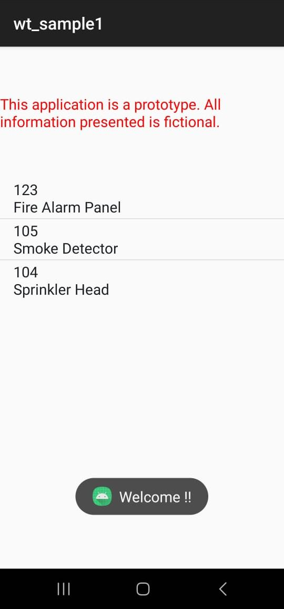
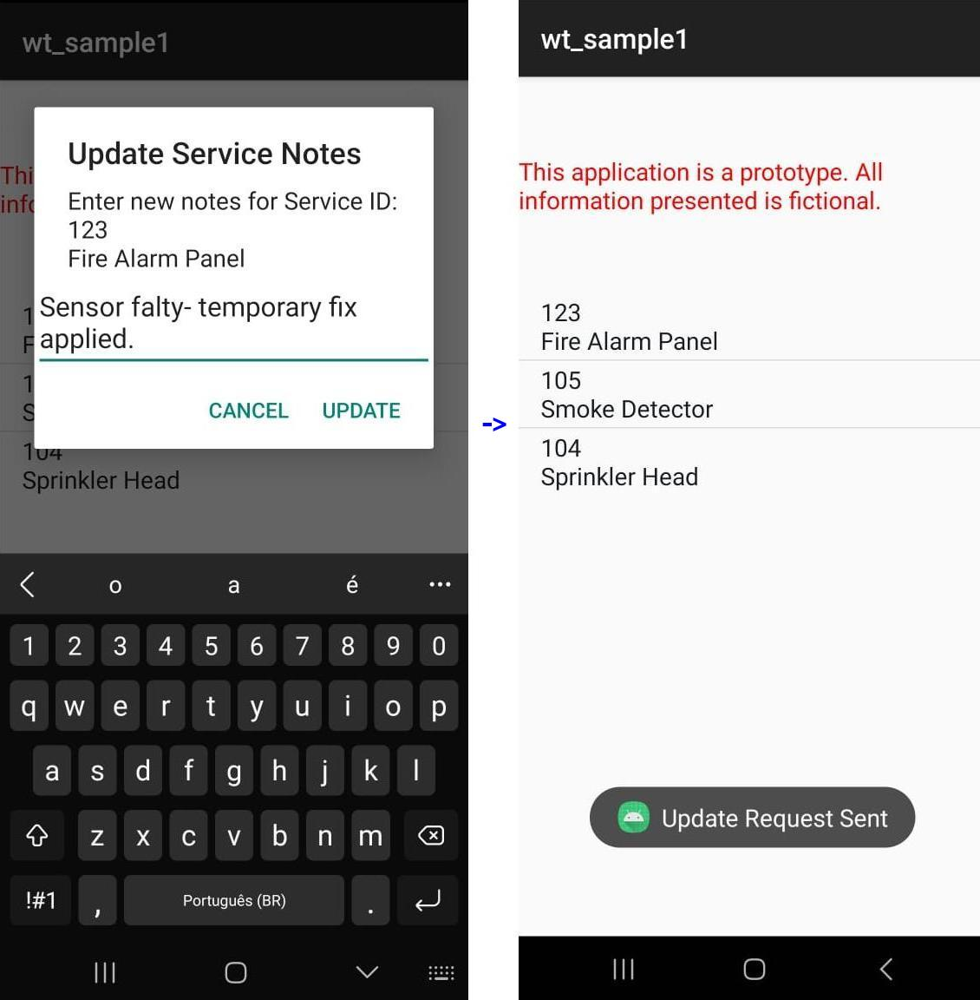
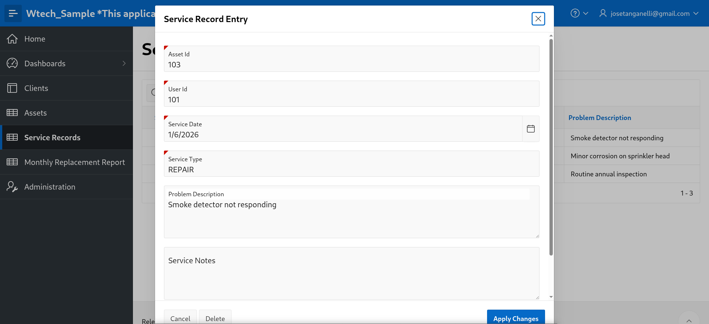

# 🔥 Fire Protection Asset & Service Management – Demo System

> ⚠️ **This is a demonstration system. All data shown is fictional and used for sample purposes only.**

---

## Overview

This project is a **demonstration asset lifecycle and service management system** designed around real-world fire protection operations. It showcases the integration of a **relational database**, **Oracle APEX** for rapid application development, and an **Android mobile application** for field technicians.

The system models the lifecycle of fire safety equipment such as **sprinklers, fire extinguishers, smoke detectors, and fire alarm panels**, supporting installation tracking, replacement planning, and service activity recording.

---

## Key Features

- Asset lifecycle tracking (installation, MTBF, MTTR, replacement dates)
- Automated identification of due and overdue assets
- Monthly replacement and compliance reporting
- Mobile-friendly service record updates
- REST-based integration between backend and mobile app
- Clean, performance-oriented UI/UX

---

## System Architecture

Oracle Database
|
| (SQL / PL/SQL)
|
Oracle APEX Application
|
| (REST APIs via ORDS)
|
Android Mobile App

---

## Backend & Database

The backend is built on **Oracle Database**, using a fully normalised relational model with strong data integrity controls.

### Core Entities
- Clients
- Sites
- Assets (fire protection equipment)
- Users
- Service Records

### Database Features
- Primary and foreign key relationships
- Constraints and indexes for performance
- Lifecycle-focused data model
- Audit-ready structure

---

## Oracle APEX Application

link: [Oracle APEX Application](https://oracleapex.com/ords/r/tanganelli/wtech-sample/login?session=110568161924877)

- user: **adm**    password: **12345678**
- user: **user01** password: **12345678**

The Oracle APEX application provides:

- **Operational dashboards** with KPIs and charts
- **Interactive reports** with filtering and conditional formatting
- **Asset detail forms** with lifecycle data
- **Monthly replacement reports** including client contact details
- **Replacement planning calendar**

The UI/UX is designed for both **office-based staff and management**, with a focus on clarity, speed, and compliance visibility.

---

## Mobile Application (Android)

- user: **adm**    password: **12345678**
- user: **user01** password: **12345678**

A lightweight **Android mobile application built with React Native** demonstrates field service workflows.

### Mobile Features
- User authentication (demo credentials)
- Service record list retrieved via Oracle REST Data Services
- Update service notes directly from site visits
- Real-time database updates via REST (PUT operations)

This reflects real-world technician usage and remote system support.

---

## REST Integration

**Oracle REST Data Services (ORDS)** is used to expose secure REST endpoints from Oracle APEX, enabling:

- GET access to service records
- PUT updates to service notes
- Stateless integration with mobile devices

---

## Screenshots

Screenshots illustrating dashboards, asset management, reports, and mobile workflows are available in the `/screenshots` directory.

---

### Asset Lifecycle Management
Interactive asset list with conditional formatting based on replacement dates. Enables rapid identification of assets that are due or overdue for replacement across multiple client sites.

### Asset Detail & Lifecycle Tracking
Asset detail page used to manage installation data, lifecycle metrics (MTBF/MTTR), and automated replacement scheduling. Designed to minimise data entry errors and support long-term asset tracking.

### Service Records List
Service Records List page used to represents inspections, services, or replacement activities performed on asset.

### Service Records Entry
Service Records Entry page used to represent an inspection, service, or replacement activity performed on an asset.

### Operations Dashboard (Oracle APEX)
High-level operational dashboard providing real-time visibility of fire protection assets. KPI indicators highlight total assets, items due for replacement in the next 30 days, and overdue assets, while charts display replacement trends by month and asset distribution by type. Designed to support operational planning, compliance monitoring, and management decision-making.

### Monthly Replacement Report
Report identifying assets due for replacement by month, including client contact details. Supports planning, customer communication, and regulatory compliance.
p.s. the month filter was removed to bring data to the dataset. 

---

### Android Mobile App – Login
Login screen for the Android field-service application built with React Native. Provides authenticated access for technicians and staff before interacting with service records retrieved from the Oracle APEX backend.

### Android Mobile App – Asset List
Asset list screen displaying fire protection equipment assigned to client sites. Designed for field technicians to quickly identify assets, review key details, and prioritise items that are due or overdue for replacement.

### Android Mobile App – Update Service Notes
Field technicians can update service notes directly from site visits. Changes are sent via REST (PUT) requests to Oracle APEX, updating the central database in real time.

Database table before update: 

Database table after update: 

## Technologies Used

- **Oracle Database** (SQL, relational modelling)
- **Oracle APEX** (dashboards, reports, forms, UX-focused design)
- **Oracle REST Data Services (ORDS)**
- **Android**
- **RESTful APIs**

---

## Intended Purpose

This project was created as a **portfolio and demonstration system**, aligned with the type of database development, system integration, and mobile support work performed in fire protection and compliance-driven environments.

---

## Disclaimer

This application is a **prototype/demo system only**.  
All data, clients, assets, and service records are fictional and used solely for demonstration purposes.

---

## Author

Jose Maria Tanganelli

Developed as a demonstration project showcasing:
- Database-driven application design
- Oracle APEX development
- Mobile integration with enterprise systems
- UI/UX and performance-focused thinking

